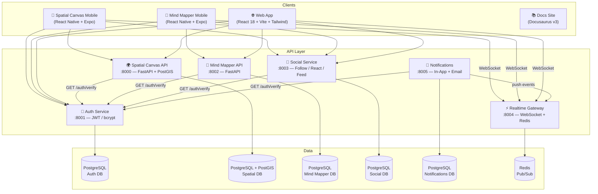

<!-- Badges -->
<p align="center">
  <a href="https://github.com/zylvex-tech/zylvex-technologies/actions/workflows/auth-ci.yml"></a>
  <a href="https://github.com/zylvex-tech/zylvex-technologies/actions/workflows/spatial-canvas-ci.yml"></a>
  <a href="https://github.com/zylvex-tech/zylvex-technologies/actions/workflows/mind-mapper-ci.yml"></a>
  <a href="https://github.com/zylvex-tech/zylvex-technologies/actions/workflows/mobile-ci.yml"></a>
  <a href="LICENSE"></a>
  <a href="CONTRIBUTING.md"></a>
</p>

---

<h1 align="center">Zylvex Technologies</h1>

<p align="center">
  <strong>The new interface between reality, cognition, and community.</strong>
</p>

<p align="center">
  Spatial-social computing platform — AR anchors on the physical world + BCI-powered mind maps.<br>
  Six microservices, two mobile apps, a full web frontend, and production notebooks — all in one repo.
</p>

---

## Two Products, One Platform

<table>
<tr>
<td width="50%" valign="top">

### 🌍 Spatial Canvas

Drop geo-tagged content into the real world. Point your phone, tap, and an AR anchor sticks to that exact latitude/longitude — visible to every user within radius.

- **Backend:** FastAPI + PostGIS radius queries
- **Mobile:** React Native + Expo camera overlay
- **Web:** Leaflet map with anchor pins + detail drawer

</td>
<td width="50%" valign="top">

### 🧠 Mind Mapper

Turn cognitive focus into shareable knowledge trees. A BCI headband (or built-in focus simulator) colors each node by attention level — green for deep focus, red for distraction.

- **Backend:** FastAPI + hierarchical node tree + BCI sessions
- **Mobile:** React Native with focus slider simulator
- **Web:** ReactFlow interactive canvas with 3D export

</td>
</tr>
</table>

**Shared infrastructure** powers both products: JWT auth service, social graph (follow/react/feed), real-time WebSocket gateway (Redis pub/sub), notifications (in-app + email), and a Docusaurus documentation site.

---

## Architecture



---

## Quick Start

> **Prerequisites:** [Docker](https://docs.docker.com/get-docker/) & Docker Compose

```bash
git clone https://github.com/zylvex-tech/zylvex-technologies.git && cd zylvex-technologies
cp .env.example .env                                    # review & set JWT_SECRET
docker compose -f docker-compose.full-stack.yml up --build
```

| Service | URL | Docs |
|---------|-----|------|
| Auth Service | `http://localhost:8001` | [`/docs`](http://localhost:8001/docs) |
| Spatial Canvas API | `http://localhost:8000` | [`/docs`](http://localhost:8000/docs) |
| Mind Mapper API | `http://localhost:8002` | [`/docs`](http://localhost:8002/docs) |
| Social Graph API | `http://localhost:8003` | [`/docs`](http://localhost:8003/docs) |
| Realtime Gateway | `ws://localhost:8004` | — |
| Notifications | `http://localhost:8005` | [`/docs`](http://localhost:8005/docs) |
| Web App | `http://localhost:3000` | — |
| Documentation Site | `http://localhost:3001` | — |

---

## Screenshots

> Real screenshots coming soon — placeholders below.

| `[Spatial Canvas AR View]` | `[Mind Map 3D Canvas]` | `[BCI Focus Timeline]` |
|:-:|:-:|:-:|
| AR camera overlay with geo-anchored content pins | Interactive ReactFlow canvas with focus-colored nodes | BCI session timeline with peak detection |

---

## Notebook Previews

Interactive Jupyter notebooks with dark-themed Plotly charts, synthetic data, and `ipywidgets` sandboxes.

| Notebook | Description |
|----------|-------------|
| [`spatial_canvas_3d.ipynb`](docs/notebooks/spatial_canvas_3d.ipynb) | 200 anchors across 4 cities — Folium clustered map, 3D scatter, animated timeline, analytics dashboard |
| [`mind_map_3d.ipynb`](docs/notebooks/mind_map_3d.ipynb) | 25-node hierarchical tree — NetworkX 3D layouts, focus-colored Plotly network graph, BCI heatmap |
| [`bci_focus_analysis.ipynb`](docs/notebooks/bci_focus_analysis.ipynb) | 5 BCI sessions × 600 pts — multi-session overlay, SciPy peak detection, 3D surface, violin plots |

---

## Roadmap

| Phase | Milestone | Status |
|-------|-----------|--------|
| **Phase 1 — Foundation** | Auth service (JWT, rate limiting, 15 tests) | ✅ |
| | Spatial Canvas backend (PostGIS CRUD, 9 tests) | ✅ |
| | Mind Mapper backend (node tree, BCI sessions, 10 tests) | ✅ |
| | Mobile apps (Spatial Canvas + Mind Mapper) | ✅ |
| | Web app (React 18, Vite, Tailwind, Framer Motion) | ✅ |
| **Phase 2 — Social & Real-Time** | Social graph service (follow, react, feeds, 16 tests) | ✅ |
| | Realtime WebSocket gateway (Redis pub/sub) | ✅ |
| | Notifications service (in-app + SendGrid email) | ✅ |
| | Interactive mind map canvas (ReactFlow) | ✅ |
| | Jupyter visualization notebooks (6 notebooks) | ✅ |
| | Docusaurus documentation site | ✅ |
| | Docker Compose full-stack (13 containers) | ✅ |
| **Phase 3 — Scale & Ship** | Email verification & password reset | ⬜ |
| | Redis auth token caching | ⬜ |
| | PostGIS Geometry → Geography migration | ⬜ |
| | Anchor media uploads (S3/GCS signed URLs) | ⬜ |
| | Kubernetes manifests + Helm charts | ⬜ |
| | Terraform IaC (AWS/GCP) | ⬜ |
| | Prometheus + Grafana monitoring | ⬜ |
| | Real BCI hardware adapter (Neurosity/OpenBCI) | ⬜ |
| | E2E tests (Playwright + Detox) | ⬜ |

---

## Repository Structure

```
zylvex-technologies/
├── shared/
│   ├── auth/                   JWT auth service (register/login/refresh/verify)
│   ├── social/                 Social graph (follow, reactions, feeds)
│   ├── realtime/               WebSocket gateway (Redis pub/sub)
│   └── notifications/          In-app + email notifications
├── spatial-canvas/
│   ├── backend/                FastAPI + PostGIS anchor CRUD
│   └── mobile/                 React Native AR camera (Expo)
├── mind-mapper/
│   ├── backend-services/       FastAPI mind map + BCI session API
│   └── mobile-bci/             React Native BCI app (Expo, TS)
├── web-app/                    React 18 + Vite + TS + Tailwind
├── docs-site/                  Docusaurus v3 documentation hub
├── docs/
│   ├── architecture/           ADRs + auth contract
│   └── notebooks/              6 Jupyter notebooks + HTML exports
├── scripts/sandbox/            Seed CLI, demo launcher, data generator
├── infrastructure/             Kubernetes / Terraform / Monitoring (planned)
├── docker-compose.full-stack.yml
├── CONTRIBUTING.md
├── SECURITY.md
└── LICENSE
```

---

## CI/CD

| Workflow | Trigger | Scope |
|----------|---------|-------|
| `auth-ci.yml` | Push / PR on `shared/auth/**` | Test + lint + Docker build |
| `spatial-canvas-ci.yml` | Push / PR on `spatial-canvas/backend/**` | Test + lint + Docker build |
| `mind-mapper-ci.yml` | Push / PR on `mind-mapper/**` | Test + lint + Docker build |
| `mobile-ci.yml` | Push / PR on `spatial-canvas/mobile/**` | Install + lint + type-check |
| `pr-checks.yml` | All PRs to `main` | Description, branch, analysis |
| `deploy-staging.yml` | Push to `main` | SSH deploy + Slack notify |

See [`CONTRIBUTING.md`](CONTRIBUTING.md) for development workflow, branch conventions, and commit format.

---

## Security

Found a vulnerability? Please report it responsibly — see [`SECURITY.md`](SECURITY.md).

---

## License

Proprietary — see [`LICENSE`](LICENSE) for details.

© 2024 Zylvex Technologies Ltd.
