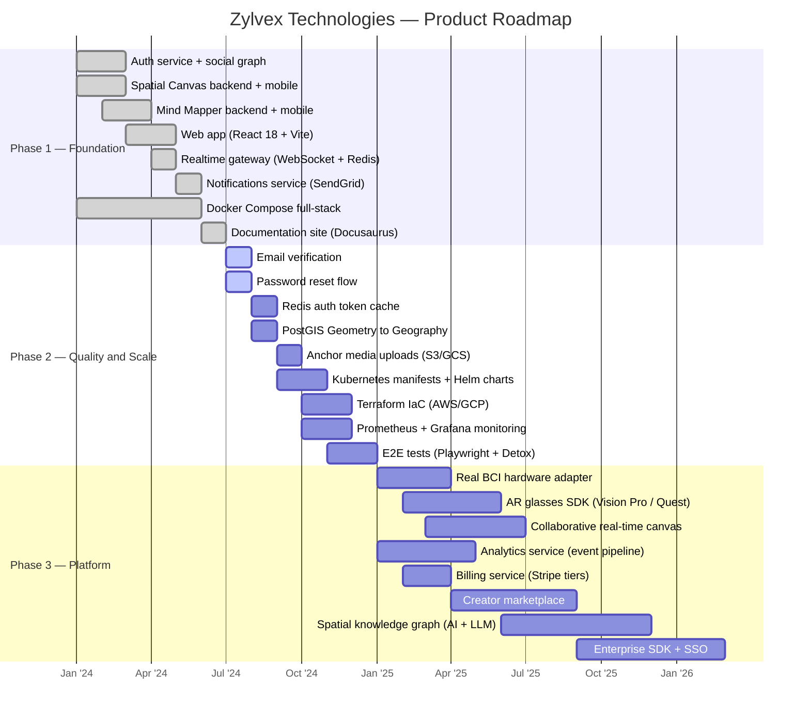

# Product Roadmap

## Visual Timeline

---

## Phase 1 — Foundation ✅ Complete

The core platform is live and production-ready.

| Milestone | Status | Details |
|-----------|--------|---------|
| Auth service | ✅ | Register, login, JWT rotation, revocation, 15 tests |
| Spatial Canvas backend | ✅ | Anchor CRUD, PostGIS radius search, 9 tests |
| Mind Mapper backend | ✅ | Mind maps, nodes, BCI sessions, 10 tests |
| Web app (React 18) | ✅ | Vite + ReactFlow canvas, dark/light mode |
| Social graph service | ✅ | Follow graph, reactions, feeds, 16 tests |
| Realtime gateway | ✅ | WebSocket + Redis pub/sub, heartbeat |
| Notifications service | ✅ | In-app + SendGrid email + push stubs, 10 tests |
| Docker Compose full-stack | ✅ | One-command local dev environment |
| Documentation site | ✅ | This Docusaurus site |

---

## Phase 2 — Quality & Scale (Q3–Q4 2024)

Focus: production hardening, remaining auth features, infrastructure.

### Auth Completions

**Email Verification**
- `POST /auth/verify-email` endpoint
- Send verification email on register (SendGrid)
- Set `User.is_verified = true` on verification

**Password Reset**
- `POST /auth/forgot-password` — send reset token via email
- `POST /auth/reset-password` — consume token, update password

### Performance

**Redis Auth Token Cache**
- Cache `/auth/verify` responses in Redis (TTL = access token lifetime)
- Eliminates PostgreSQL roundtrip on every authenticated request
- Expected ~90% reduction in auth service DB load

**PostGIS Geometry → Geography**
- Alembic migration: `Anchor.location` from `Geometry` to `Geography`
- Use `ST_DWithin` with meters instead of degree approximation
- Fixes the ~50% accuracy error at high latitudes (ADR-002)

### Storage

**Anchor Media Uploads**
- S3/GCS signed URL generation for `image/video/audio` content types
- CDN integration for low-latency delivery

### Infrastructure

**Kubernetes + Terraform**
- Helm charts for all 6 services
- Terraform modules for AWS (EKS + RDS + ElastiCache) and GCP (GKE + Cloud SQL + Memorystore)

**Monitoring**
- Prometheus metrics on all services
- Grafana dashboards (request rate, error rate, p50/p99 latency)
- PagerDuty alerting

---

## Phase 3 — Platform (2025)

Focus: AR hardware, real BCI, monetization, enterprise.

### BCI Hardware Integration

Native adapters for:
- **Neurosity Crown** — 8-channel EEG, focus/calm scores via Neurosity SDK
- **OpenBCI Ganglion** — raw EEG, custom FFT-based focus algorithm
- **Muse 2** — 4-channel EEG, lowest-cost entry point

### AR Integration

- **Apple Vision Pro** — visionOS spatial anchors, SharePlay for collaborative viewing
- **Meta Quest / WebXR** — cross-platform anchor viewer
- **Ray-Ban Meta smart glasses** — overlay anchors in field of view

### Collaborative Real-Time Canvas

- Multiple users editing the same mind map simultaneously
- CRDT-based conflict resolution
- Presence indicators and cursor sharing

### Analytics Service

- Kafka event pipeline
- User funnel analysis, anchor engagement metrics
- BCI correlation analysis (focus vs. node quality over time)

### Billing Service

- Stripe integration
- Free/Pro/Team/Enterprise tier enforcement (see [Monetization](./monetization))
- Usage metering (API calls, anchor storage, BCI session hours)

---

## Sprint Backlog (Immediate Next Steps)

In priority order:

1. Email verification (`POST /auth/verify-email`)
2. Password reset (`POST /auth/forgot-password` + `/auth/reset-password`)
3. Redis cache for auth token verification
4. PostGIS `Geometry` → `Geography` migration
5. Anchor media uploads (S3/GCS signed URLs)
6. Kubernetes manifests + Helm charts
7. Terraform IaC (AWS/GCP)
8. Prometheus + Grafana monitoring
9. E2E tests: Playwright (web) + Detox (mobile)
10. Real BCI hardware adapter (Neurosity Crown first)
