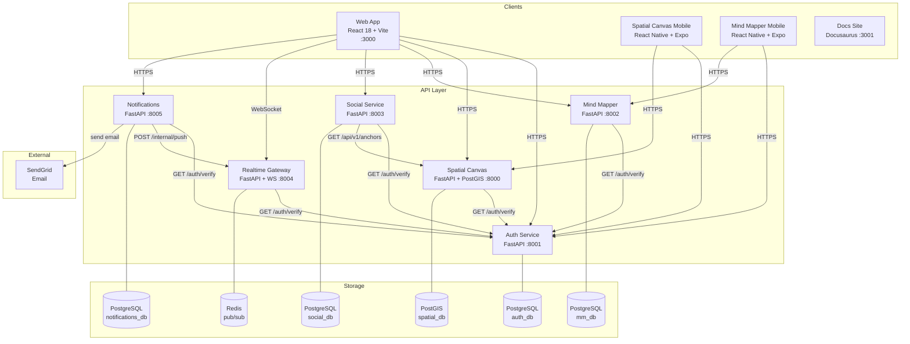
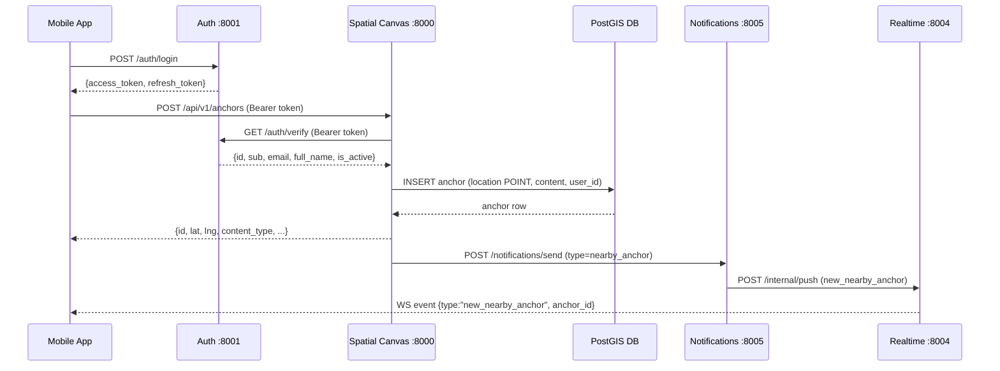
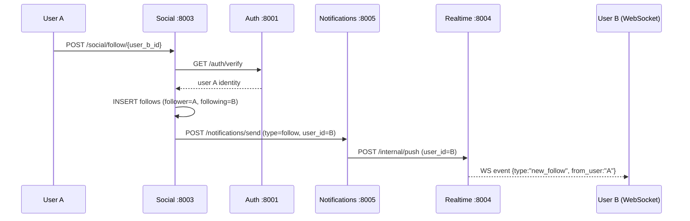
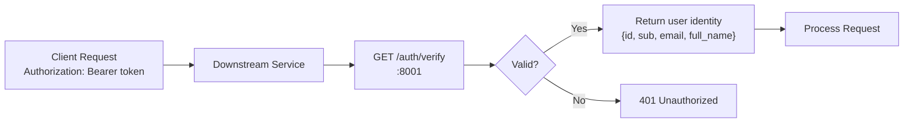

# Architecture Overview

This page describes the full Zylvex system: all services, data flows, and how everything connects.

## System Diagram

---

## Data Flow: User Creates an Anchor

---

## Data Flow: Social Follow

---

## Auth Pattern (Critical)

:::warning Single Auth Service
**No downstream service ever verifies JWTs locally.** Every authenticated endpoint calls `GET /auth/verify` on the shared auth service. This is the single source of truth for token validity and revocation.
:::

---

## Service Responsibilities

| Service | Port | Database | Key Responsibilities |
|---------|------|----------|---------------------|
| Auth | 8001 | PostgreSQL | Register, login, JWT issuance, token rotation, revocation |
| Spatial Canvas | 8000 | PostGIS | Anchor CRUD, radius search, content types |
| Mind Mapper | 8002 | PostgreSQL | Mind map + node CRUD, BCI session recording |
| Social | 8003 | PostgreSQL | Follow graph, reactions, nearby/trending feeds |
| Realtime | 8004 | Redis | WebSocket connections, pub/sub fan-out, heartbeat |
| Notifications | 8005 | PostgreSQL | In-app notifications, SendGrid email, push stubs |

---

## Technology Decisions

| Decision | Choice | Rationale |
|----------|--------|-----------|
| Auth pattern | Shared service, no local JWT verify | Centralized revocation, single source of truth |
| Spatial indexing | PostGIS Geometry + GiST index | Simplicity (known limitation: inaccurate at high latitudes — ADR-002) |
| Real-time | Redis pub/sub | Horizontal scaling of WebSocket servers |
| BCI integration | Slider simulation → real hardware stub | Allows UX development before hardware availability |
| Mobile framework | React Native + Expo | Cross-platform (iOS + Android) with web parity |

---

## Known Architectural Issues

1. **PostGIS Geometry vs Geography** (`ADR-002`): `Anchor.location` uses `Geometry` with degree-based radius approximation (~50% error at 60°N). Migration to `Geography` + `ST_DWithin` with meters is planned.
2. **No auth token caching** (`ADR-001`): Every request hits auth service → PostgreSQL. Redis TTL cache planned.
3. **No email verification**: `User.is_verified` exists in DB but verification email is not yet sent on register.
4. **Media uploads incomplete**: Anchor supports `image|video|audio` content types but only `text` is implemented; S3/GCS signed URLs planned.
